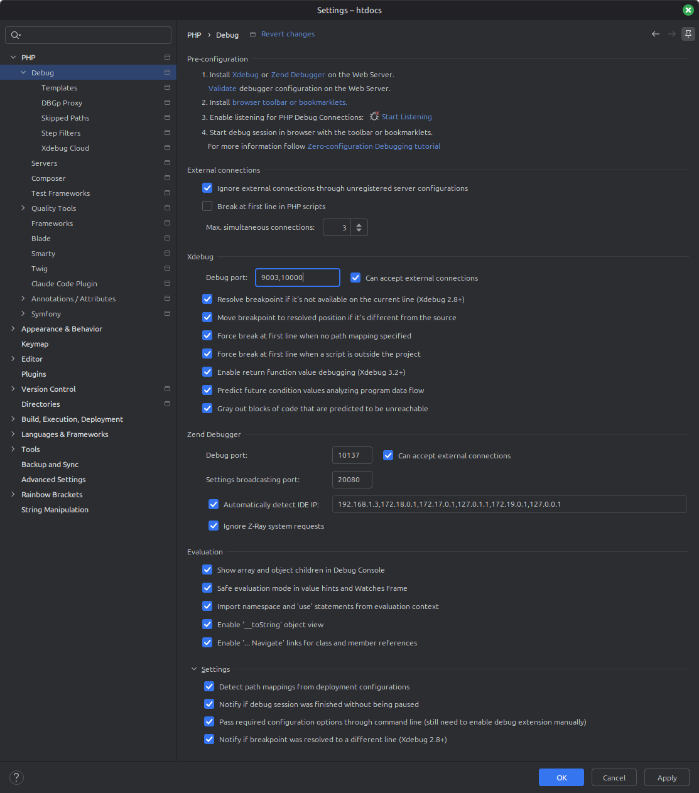
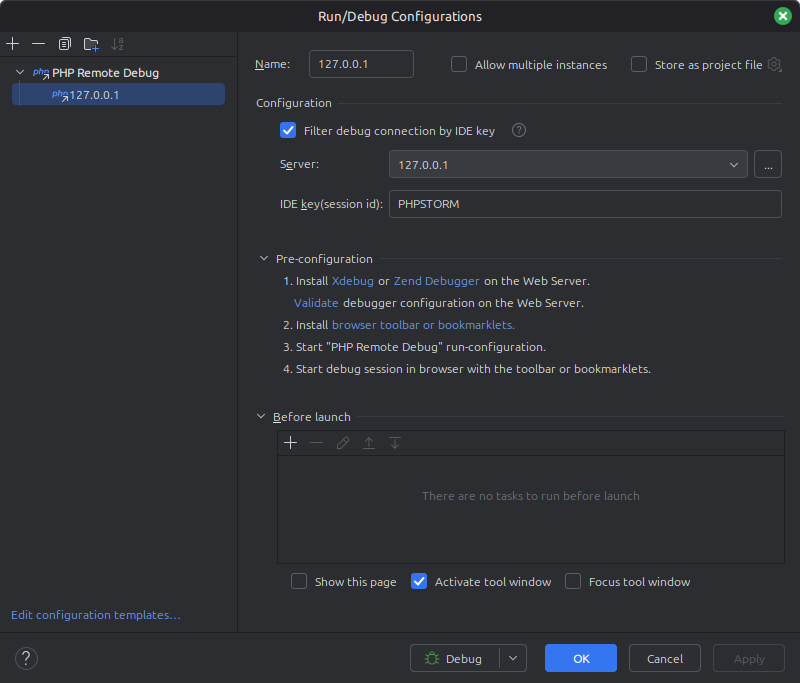
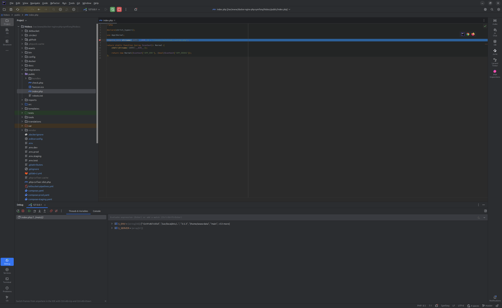

# Xdebug Configuration & Usage
This document describes how to configure and use [Xdebug](https://xdebug.org/) with [PhpStorm](https://www.jetbrains.com/phpstorm/) in our local development environment.

> Prerequisite: Please ensure you have completed the [PhpStorm Setup Guide](phpstorm.md) before proceeding with the actions described below.

## Basic Configuration

1. Verify Xdebug Configuration Files

   Check `/docker/dev/xdebug-main.ini` (for Linux/Windows) or `/docker/dev/xdebug-osx.ini` (for macOS).
   * If you want to debug every request to the API automatically (by default), set:
   ```ini
   xdebug.start_with_request = yes
   ```

   * If you want to debug only requests triggered by your browser (via the `PHPSTORM` IDE key), set:
   ```ini
   xdebug.start_with_request = no
   ```

2. Configure PhpStorm Port

   Go to `Settings` -> `PHP` -> `Debug` and ensure the Xdebug port is set to `10000`.

3. Run/Debug Configurations

   Verify that your Run/Debug configuration matches the images below:

   
   

4. Browser Extension (Optional)
   
   If you opted for `xdebug.start_with_request = no` in step 1, install a browser extension (e.g., `Xdebug Helper` for Firefox/Chrome) and set the IDE KEY to `PHPSTORM` in its settings.

## Using Xdebug (Web Requests)
Once configured, you can start debugging incoming PHP connections:

1. Add a breakpoint to your code.
2. Enable Xdebug in your browser via the extension (only required if `xdebug.start_with_request = no`).
3. Click the `Debug` button in PhpStorm.
4. Reload the page in your browser or execute the endpoint.

If everything is configured properly, PhpStorm will intercept the request:



## Debugging Postman Requests
If you are using Postman to test your application and your configuration is set to `xdebug.start_with_request = no`, you must append `?XDEBUG_SESSION_START=PHPSTORM` to the URL query string for each request you want to debug.

If you are using the default configuration (`xdebug.start_with_request = yes`), Xdebug will intercept Postman requests automatically out of the box.

## Debugging Console Commands & Messenger Async Handlers

### 1. Host IP Configuration (Linux only)
To debug CLI commands or async handlers on Linux, you must explicitly set the `xdebug.client_host` option inside `docker/dev/xdebug-main.ini`:
```ini
xdebug.client_host=172.17.0.1
```
> Note: Find the proper host IP in your Docker bridge configuration (usually `172.17.0.1`). If you make changes, don't forget to rebuild the Docker containers according to the [general documentation](../readme.md).
> (macOS users using `XDEBUG_CONFIG=osx` do not need to do this, as `host.docker.internal` is handled automatically).

### 2. Debugging Messenger Async Jobs
To debug a message handler, you must stop the background worker and run the consumer manually. Follow these 3 phases:

**Phase 1: Stop the background worker**
1. Enter the `supervisord` container: `make ssh-supervisord`.
2. Open the supervisor shell by running the command: `supervisorctl`.
3. Stop the consumer `messenger-consume:messenger-consume_00` using the command: `stop messenger-consume:messenger-consume_00`.
4. Wait for the `messenger-consume:messenger-consume_00: stopped` confirmation message, then type `exit` to leave supervisorctl.
5. Type `exit` again to leave the container and return to your local shell.

**Phase 2: Run the consumer manually**
1. Trigger the action in your app to put the necessary message into the queue.
2. Click the `Debug` button in PhpStorm.
3. Enter the `symfony` container: `make ssh`.
4. Run the consumer manually inside the `symfony` container shell, limiting it to 1 message to catch your specific job:
   ```bash
   /usr/local/bin/php bin/console messenger:consume async_priority_high async_priority_low --limit=1
   ```

**Phase 3: Clean up**

After you finish debugging, you must restart the background worker. The easiest way to restore the environment is to run `make restart` from your local shell. Alternatively, you can go back into `supervisorctl` and run `start messenger-consume:messenger-consume_00`.

---

## External References
* [Debugging PHP (web and cli) with Xdebug using Docker and PhpStorm](https://thecodingmachine.io/configuring-xdebug-phpstorm-docker)
* [Debug your PHP in Docker with Intellij/PhpStorm and Xdebug](https://gist.github.com/jehaby/61a89b15571b4bceee2417106e80240d)
* [Debugging with Postman and PhpStorm (Xdebug)](https://www.thinkbean.com/drupal-development-blog/debugging-postman-and-phpstorm-xdebug)
